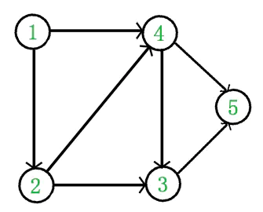
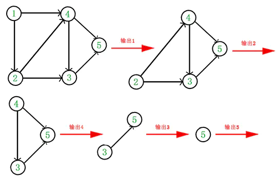
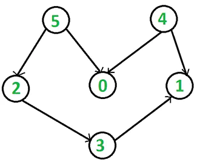

# 什么是拓扑排序（Topological Sorting）

(文章引用于[http://songlee24.github.io/2015/05/07/topological-sorting/](https://link.jianshu.com?t=http://songlee24.github.io/2015/05/07/topological-sorting/)）

**一、什么是拓扑排序**
 在图论中，**拓扑排序（Topological Sorting**）是一个有向无环图（DAG, Directed Acyclic Graph）的所有顶点的线性序列。且该序列必须满足下面两个条件：

1. 每个顶点出现且只出现一次。
2. 若存在一条从顶点 A 到顶点 B 的路径，那么在序列中顶点 A 出现在顶点 B 的前面。

有向无环图（DAG）才有拓扑排序，非DAG图没有拓扑排序一说。

例如，下面这个图：



top1.png

它是一个 DAG 图，那么如何写出它的拓扑排序呢？这里说一种比较常用的方法：

1. 从 DAG 图中选择一个 没有前驱（即入度为0）的顶点并输出。
2. 从图中删除该顶点和所有以它为起点的有向边。
3. 重复 1 和 2 直到当前的 DAG 图为空或当前图中不存在无前驱的顶点为止。后一种情况说明有向图中必然存在环。



top2.png

于是，得到拓扑排序后的结果是 { 1, 2, 4, 3, 5 }。

通常，一个有向无环图可以有一个或多个拓扑排序序列。

**二、拓扑排序的应用**
 拓扑排序通常用来“排序”具有依赖关系的任务。

比如，如果用一个DAG图来表示一个工程，其中每个顶点表示工程中的一个任务，用有向边 表示在做任务 B 之前必须先完成任务 A。故在这个工程中，任意两个任务要么具有确定的先后关系，要么是没有关系，绝对不存在互相矛盾的关系（即环路）。

**三、拓扑排序的实现**

根据上面讲的方法，我们关键是要维护一个入度为0的顶点的集合。

图的存储方式有两种：邻接矩阵和邻接表。这里我们采用邻接表来存储图，C++代码如下：

```cpp
#include<iostream>
#include <list>
#include <queue>
using namespace std;

/************************类声明************************/
class Graph
{
    int V;             // 顶点个数
    list<int> *adj;    // 邻接表
    queue<int> q;      // 维护一个入度为0的顶点的集合
    int* indegree;     // 记录每个顶点的入度
public:
    Graph(int V);                   // 构造函数
    ~Graph();                       // 析构函数
    void addEdge(int v, int w);     // 添加边
    bool topological_sort();        // 拓扑排序
};

/************************类定义************************/
Graph::Graph(int V)
{
    this->V = V;
    adj = new list<int>[V];

    indegree = new int[V];  // 入度全部初始化为0
    for(int i=0; i<V; ++i)
        indegree[i] = 0;
}

Graph::~Graph()
{
    delete [] adj;
    delete [] indegree;
}

void Graph::addEdge(int v, int w)
{
    adj[v].push_back(w); 
    ++indegree[w];
}

bool Graph::topological_sort()
{
    for(int i=0; i<V; ++i)
        if(indegree[i] == 0)
            q.push(i);         // 将所有入度为0的顶点入队

    int count = 0;             // 计数，记录当前已经输出的顶点数 
    while(!q.empty())
    {
        int v = q.front();      // 从队列中取出一个顶点
        q.pop();

        cout << v << " ";      // 输出该顶点
        ++count;
        // 将所有v指向的顶点的入度减1，并将入度减为0的顶点入栈
        list<int>::iterator beg = adj[v].begin();
        for( ; beg!=adj[v].end(); ++beg)
            if(!(--indegree[*beg]))
                q.push(*beg);   // 若入度为0，则入栈
    }

    if(count < V)
        return false;           // 没有输出全部顶点，有向图中有回路
    else
        return true;            // 拓扑排序成功
}
```

测试如下DAG图：



top2.png

```cpp
int main()
{
    Graph g(6);   // 创建图
    g.addEdge(5, 2);
    g.addEdge(5, 0);
    g.addEdge(4, 0);
    g.addEdge(4, 1);
    g.addEdge(2, 3);
    g.addEdge(3, 1);

    g.topological_sort();
    return 0;
}
```

输出结果是 4, 5, 2, 0, 3, 1。这是该图的拓扑排序序列之一。

每次在入度为0的集合中取顶点，并没有特殊的取出规则，随机取出也行，这里使用的queue。取顶点的顺序不同会得到不同的拓扑排序序列，当然前提是该图存在多个拓扑排序序列。

由于输出每个顶点的同时还要删除以它为起点的边，故上述拓扑排序的时间复杂度为$O(V+E)$。

另外，拓扑排序还可以采用 深度优先搜索（DFS）的思想来实现，详见《topological sorting via DFS》。
