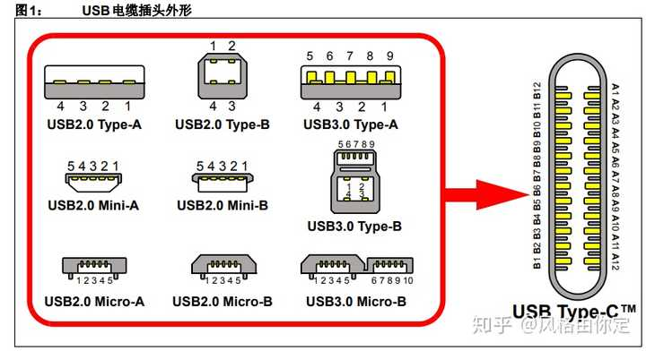
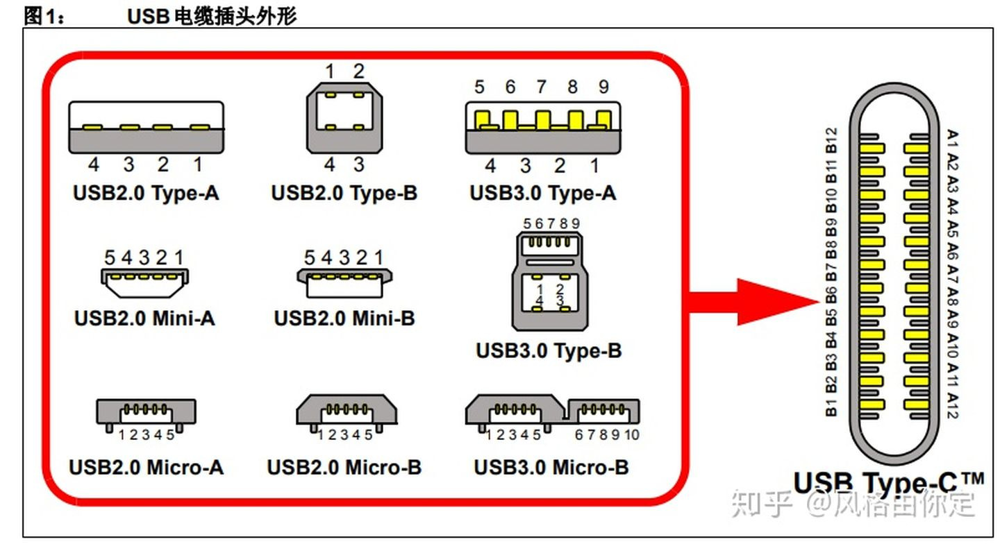
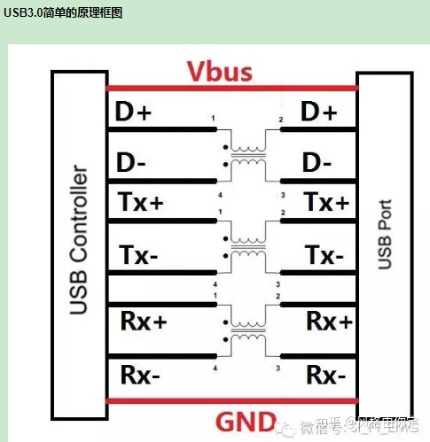
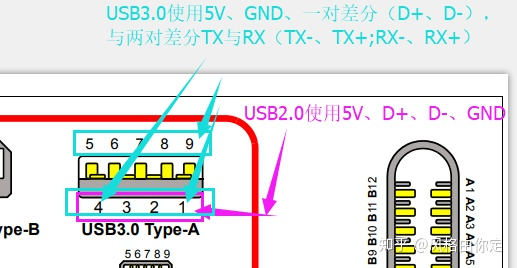
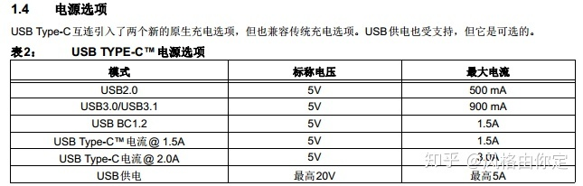

# USB3和2

作者：风格由你定
链接：https://www.zhihu.com/question/28081066/answer/532723526
来源：知乎
著作权归作者所有。商业转载请联系作者获得授权，非商业转载请注明出处。

## 一、物理接口的差异

先来这个全家USB的接口定义图，一目了然！！

USB2.0的传输速率为480Mbps，即60MB/s，

USB3.0的传输速率为5.0Gbps，即625MB/S，

从当年USB1.0的1.5Mbps，到后来的USB1.1的12Mbps，

在2015年，USB-IF协会更是发布了速率为10Gbps的USB3.1版本。

**SB3.0又称为SuperSpeed USB总线，与高速（High Speed）USB2.0总线相比，为了达到总线对USB2.0/1.1/1.0的向下兼容，**

**总线保留了USB2.0信号线（D+，D-，Vbus，GND），同时增加了两对USB 3.0超高速差分信号（SSTX+，SSTX-，SSRX+，SSRX-），一组差分对用来发射信号，另一组接收信号，从而实现全双工传输，USB3.0信号传输速率达到5Gbps；电流最大达到900mA；在EMC方面，为了达到降低EMI的影响，增加了SSC（扩频时钟）功能。**

## **二、电流的差异**

