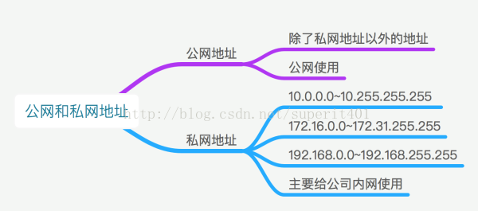
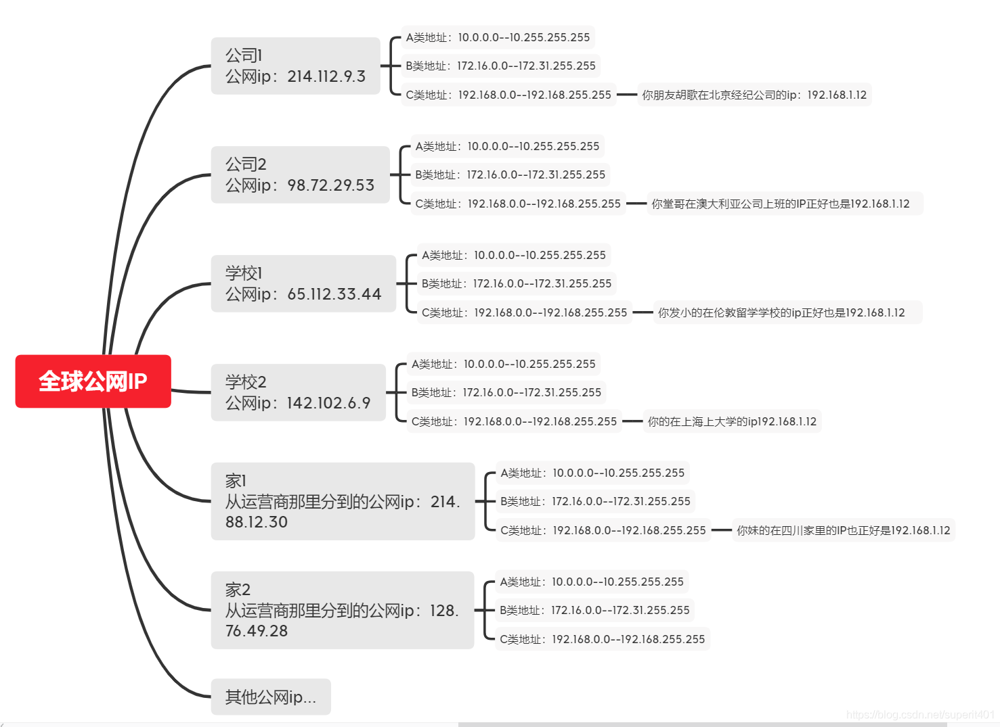

在这三类地址中，绝大多数的IP地址都是公有地址，需要向国际互联网信息中心申请注册。但是在IPv4地址协议中预留了3个IP地址段，作为私有地址，供组织机构内部使用。
这三个地址段分别位于A、B、C三类地址内：
A类地址：10.0.0.0--10.255.255.255
B类地址：172.16.0.0--172.31.255.255 

 

C类地址：192.168.0.0--192.168.255.255

IP地址范围：1.0.0.1——255.255.255.254

（参考：https://zhidao.baidu.com/question/1756686766672478628.html）

在公网（连Internet的）是看不到这些IP的，使用这些IP一定是你在公司或学校内网中，比如公司路由下。这些私有地址在公司（组织）内网中，可重复出现在不同公司组织内部。比如你在公司内部的使用分配到的内网ip192.168.1.12和另一家公司的朋友QQ聊天，碰巧他的内网ip也是192.168.1.12，但是你俩不会ip冲突，因为你们处于不同组织内部，也就是不同公网IP下的内网IP，是可以重复的。不同的是你们俩通过网关对应公网的IP，即不能重复。但是这IP（已分配为私有地址）不会出现在公网Internet中，因为公网IP全球唯一，否则就冲突了。公网是不会使用者三类地址的，即使用者三类IP的一定在公司或者学校（组织）内网中，公网是看不到的。  

理论上每个公网IP（公网地址）下都可以在其内网（如学校、公司内部网络或者你宿舍宽带分配的内网ip）分配私网地址（如下图），即公网地址全球唯一不可重复，但是每个公网地址下的私网地址可以重复，因为这些私网地址，就是分配给内网使用的，一般公网上是访问不到这些内网地址的。

以上说那么多只用这张图总结：

这些地址是不会被Internet分配的，它们在Internet上也不会被路由，虽然它们不能直接和Internet网连接，但通过技术手段仍旧可以和Internet通讯。我们可以根据需要来选择适当的地址类，在内部局域网中将这些地址像公用IP地址一样地使用。在Internet上，有些不需要与Internet通讯的设备，如打印机、可管理集线器等也可以使用这些地址，以节省IP地址资源。机器比较少的话用A B 类地址肯定是不理智的，价格也会很昂贵的。

 

内网一般也就几十台 到几百台机器  用c类地址每段都可以容纳254台主机 是比较理智的选择。

 

 

但内网要想和外部Internet链接就需要转换成公网唯一IP与外部链接，需要使用路由NAT转换。
NAT（Network Address Translation，网络地址转换）是1994年提出的。当在专用网内部的一些主机本来已经分配到了本地IP地址（即仅在本专用网内使用的专用地址），但现在又想和因特网上的主机通信（并不需要加密）时，可使用NAT方法。
这种方法需要在专用网连接到因特网的路由器上安装NAT软件。装有NAT软件的路由器叫做NAT路由器，它至少有一个有效的外部全球IP地址。这样，所有使用本地地址的主机在和外界通信时，都要在NAT路由器上将其本地地址转换成全球IP地址，才能和因特网连接。
另外，这种通过使用少量的公有IP 地址代表较多的私有IP 地址的方式，将有助于减缓可用的IP地址空间的枯竭。

 

（参考：NAT百度百科https://baike.baidu.com/item/nat/320024）

 

 

NAT 之内的 PC 联机到 Internet 上面时，他所显示的 IP 是 NAT 主机的公共 IP，所以 Client 端的 PC 当然就具有一定程度的安全了，外界在进行 portscan（端口扫描） 的时候，就侦测不到源Client 端的 PC 。
AT的主要作用，是解决IP地址数量紧缺。当大量的内部主机只能使用少量的合法的外部地址，就可以使用NAT把内部地址转化成外部地址。
NAT还可以防止外部主机攻击内部主机（或服务器）。

 

 

**附**

IP地址（0.0.0.0——255.255.255.254）分类：

A类：

0.0.0.0---127.255.255.255 （其中私有：10.0.0.0---10.255.255.255，保留：0.0.0.0，127.0.0.0---127.255.255.255）
B类：
128.0.0.1---191.255.255.254（其中私有：172.16.0.0---172.31.255.255，保留：169.254.0.0-169.254.255.255，191.255.255.255是广播地址，不能分配）
C类：
192.0.0.1---223.255.255.254（其中：私有：192.168.0.0---192.168.255.255）
D类：
224.0.0.1---239.255.255.254
E类：
240.0.0.1---255.255.255.254

（参考：https://jingyan.baidu.com/article/ea24bc3985f7b3da62b33188.html

https://zhidao.baidu.com/question/1756686766672478628.html）

参考：

https://www.zhihu.com/question/19813460?utm_campaign=rss&utm_medium=rss&utm_source=rss&utm_content=title

https://zhidao.baidu.com/question/587712525144438685.html

 

https://www.zhihu.com/question/21150632

 

https://www.zhihu.com/question/19813460